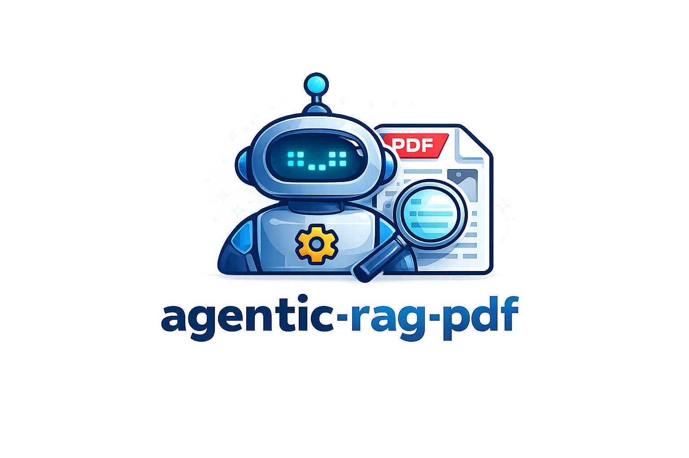
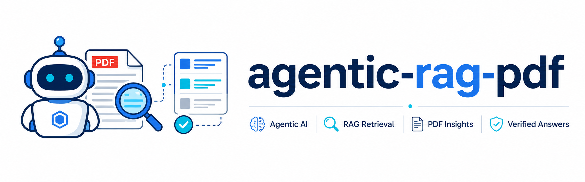

<p align="center">
  
</p>

<h1 align="center">Agentic RAG over PDF</h1>

<p align="center">
  Agentic, multimodal question answering for long PDF documents.
</p>

<p align="center">
  <a href="docs/architecture.md">Architecture</a>
  ·
  <a href="docs/demo.md">CLI Demo</a>
  ·
  <a href="docs/demo_output.md">Evaluation</a>
</p>

Agentic RAG over PDF is a small, inspectable question-answering system for long PDF documents. It combines hybrid retrieval, structural navigation, targeted page rendering, and an independent verification step so that answers can stay grounded in document evidence rather than raw model recall.

The repository is intentionally compact. The goal is not to provide a generic framework, but to show a defensible end-to-end architecture for document-grounded QA with clear traces, citations, and tests.

## Highlights

- Hybrid retrieval with BM25, dense embeddings, and Reciprocal Rank Fusion
- Tool-calling orchestrator with document search, outline lookup, and visual page inspection
- Independent verifier pass for grounded answer checking
- Support for scanned or image-only PDF pages through `view_page`
- File-backed cross-run memory that can be disabled per invocation
- Offline test suite and evaluation harness

## Contents

- [Architecture](docs/architecture.md) — system design, component choices, and trade-offs
- [CLI demo](docs/demo.md) — representative commands, traces, and screenshots
- [Evaluation results](docs/demo_output.md) — generated benchmark transcript

## CLI preview

The CLI exposes both human-readable verification details and structured JSON output, including cited pages, confidence, memory usage, and the tool-call trace.

<p align="center">
  
</p>

<p align="center">
  <sub>Example of an interactive run followed by machine-readable JSON output.</sub>
</p>

## Requirements

- Python **3.10+** (developed on Python 3.12)
- An **OpenAI API key** for both the agent and dense retrieval components

## Quick start

```bash
python3.12 -m venv .venv
source .venv/bin/activate
pip install -e ".[dev]"

cp .env.example .env
```

Set the required values in `.env`:

```bash
OPENAI_API_KEY=...
OPENAI_MODEL=gpt-4o
EMBEDDING_MODEL=text-embedding-3-small
```

## Sample documents

The repository ships with three PDFs under `samples/`:

| File | Content | Best used for |
|---|---|---|
| `samples-1.pdf` | One-page press release | simple text retrieval |
| `samples-2.pdf` | One-page scanned/image-only PDF | multimodal page viewing |
| `samples-3.pdf` | Multi-page academic article | retrieval, citations, and structure |

## CLI usage

Basic run:

```bash
agentic-rag --pdf samples/samples-3.pdf \
  --question "Bu makalenin yazarı kimdir?"
```

Useful flags:

| Flag | Purpose |
|---|---|
| `--pdf` | Path to the input PDF |
| `-q`, `--question` | Question to answer |
| `--show-trace` | Print the tool-call trace |
| `--json` | Emit structured JSON output |
| `--no-memory` | Disable both memory recall and memory persistence for the run |

Multimodal example:

```bash
agentic-rag --pdf samples/samples-2.pdf --show-trace \
  --question "Bu sayfada hangi bilgiler yer alıyor?"
```

## Evaluation

Run the bundled evaluation set:

```bash
python scripts/evaluate.py
```

This writes a generated transcript to [`docs/demo_output.md`](docs/demo_output.md). The curated screenshot-based walkthrough lives in [`docs/demo.md`](docs/demo.md).

## Tests

The test suite runs fully offline against the bundled sample PDFs:

```bash
pytest -q
```

Coverage includes preprocessing, retrieval, tool execution, memory behavior, and the end-to-end pipeline with mocked LLM calls.

## Repository structure

```text
src/agentic_rag/
  config.py
  llm.py
  preprocessing/
  retrieval/
  agents/
  memory/
  cli.py
docs/
  architecture.md
  demo.md
  demo_output.md
samples/
scripts/
tests/
eval/
```
<p align="center">
  
</p>
