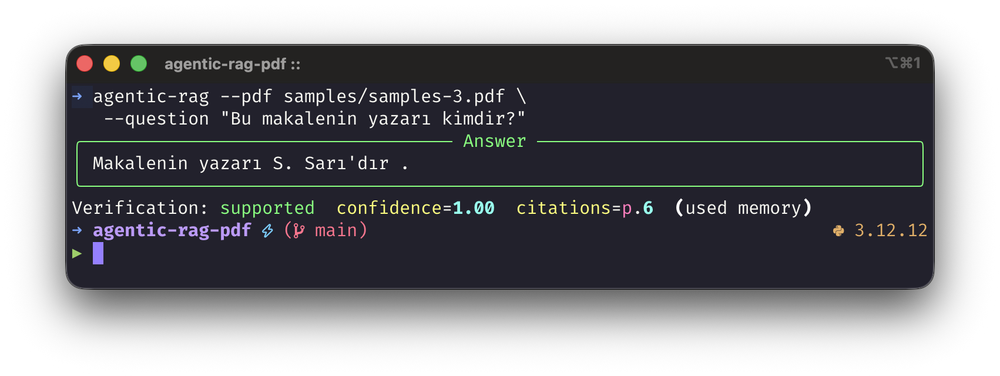
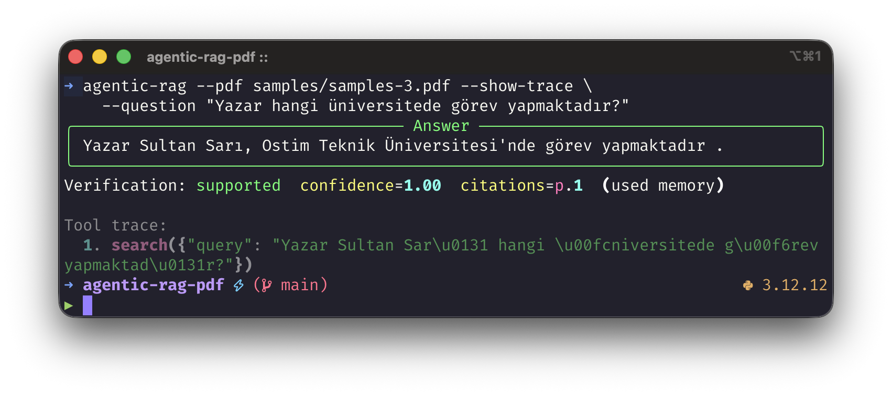
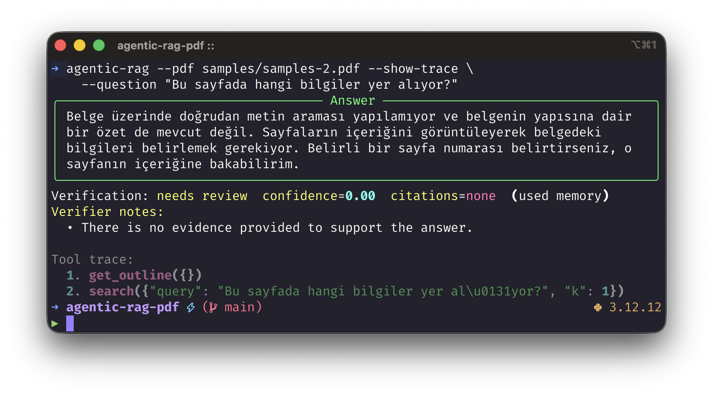
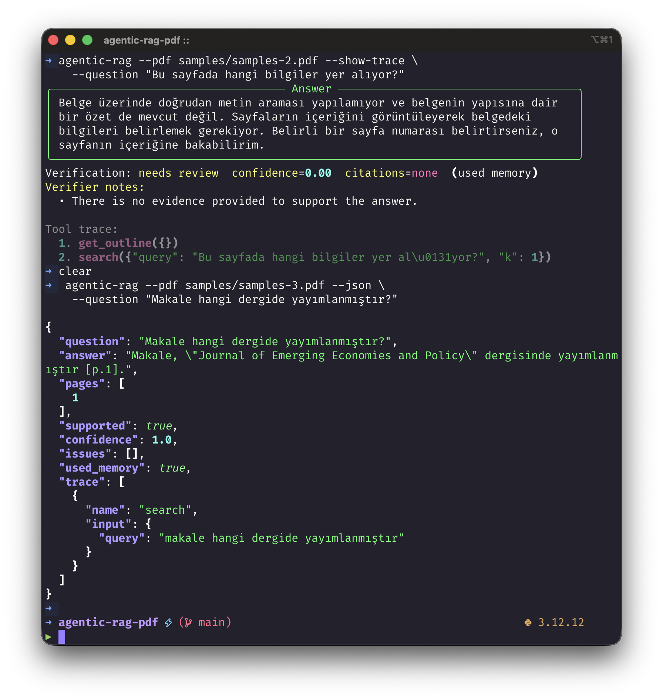
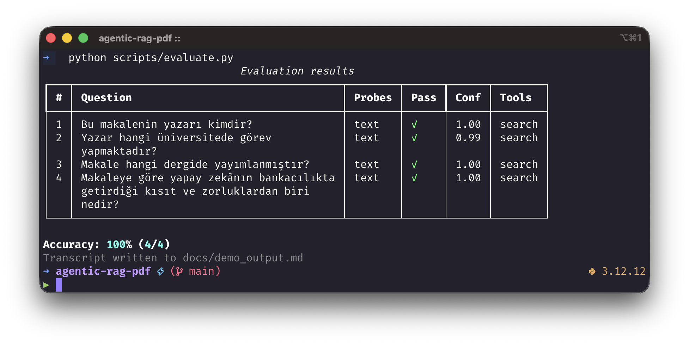

# CLI Demo

Bu doküman, `agentic-rag` CLI çıktılarının ekran görüntüleriyle birlikte sunulması için hazırlanmıştır.

Notlar:

- Bu dosya manuel olarak hazırlanır; ekran görüntülerini sen eklersin.
- Görselleri repo kökündeki `images/` klasörüne kaydet.
- Bu dokümandaki görsel bağlantıları hazırdır. Dosyaları aşağıdaki isimlerle kaydettiğinde otomatik görünürler.
- Otomatik üretilen transcript ayrı dosyadadır: [demo_output.md](./demo_output.md)

## 1. Temel soru-cevap akışı

Amaç:

- CLI’ın belgeyi okuyup cevap ürettiğini göstermek
- citation ve verification bilgisini göstermek

Komut:

```bash
agentic-rag --pdf samples/samples-3.pdf \
  --question "Bu makalenin yazarı kimdir?"
```

Kaydetmen gereken görsel adı:

`images/01-basic-answer.png`



## 2. Tool trace ile agent davranışı

Amaç:

- tool-calling akışını göstermek
- ajan trace çıktısını görünür yapmak

Komut:

```bash
agentic-rag --pdf samples/samples-3.pdf --show-trace \
  --question "Yazar hangi üniversitede görev yapmaktadır?"
```

Kaydetmen gereken görsel adı:

`images/02-tool-trace.png`



## 3. Multimodal / image-only PDF akışı

Amaç:

- metin katmanı olmayan PDF üzerinde sistemin çalıştığını göstermek
- `view_page` tabanlı davranışı görünür yapmak

Komut:

```bash
agentic-rag --pdf samples/samples-2.pdf --show-trace \
  --question "Bu sayfada hangi bilgiler yer alıyor?"
```

Kaydetmen gereken görsel adı:

`images/03-multimodal-image-only.png`



## 4. JSON çıktı modu

Amaç:

- makine-okunur çıktı formatını göstermek
- pages / supported / confidence / trace alanlarını göstermek

Komut:

```bash
agentic-rag --pdf samples/samples-3.pdf --json \
  --question "Makale hangi dergide yayımlanmıştır?"
```

Kaydetmen gereken görsel adı:

`images/04-json-output.png`



## 5. Evaluation harness özeti

Amaç:

- örnek soru-cevap seti üzerinde toplu değerlendirmeyi göstermek
- accuracy tablosunu ve sonuç özetini göstermek

Komut:

```bash
python scripts/evaluate.py
```

Kaydetmen gereken görsel adı:

`images/05-evaluation-summary.png`



## Sunum notu

Bu dosya ekran görüntülerini içerir. Metin transcript’i ve örnek sonuçlar için:

- [demo_output.md](./demo_output.md)

Öneri:

- Screenshot alırken komut satırı da görünür olsun
- terminal genişliği dar olmasın
- API key, kullanıcı adı veya gereksiz shell geçmişi görünmesin
